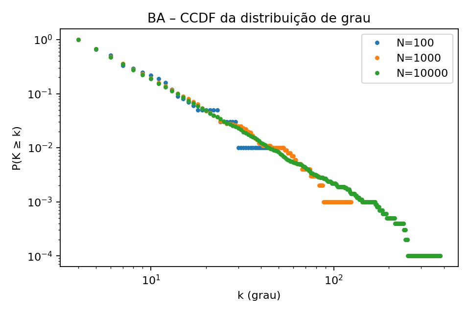
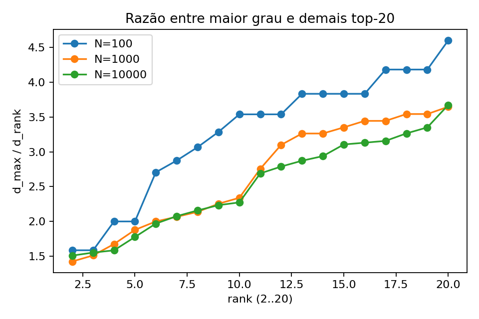

# Respostas – Barabási–Albert (BA)

Este trabalho analisa a evolução dos graus em uma rede BA com `N=10.000`, `m=4`, iniciando de um clique de 4 vértices. O script `ba_experiments.py` gera o grafo final (N=10.000) e captura snapshots como subgrafos induzidos dos primeiros `N=100`, `N=1.000` e `N=10.000` vértices para as análises pedidas.

## 1) Distribuição de grau (CCDF) para N = 100, 1K e 10K. Converge?
- A figura `./out/ba_degree_ccdf.png` sobrepõe as CCDFs para os três snapshots.
- À medida que N aumenta, as curvas aproximam-se de uma forma estável compatível com a lei de potência do modelo BA. Em escala log–log, a cauda tende a um segmento aproximadamente linear (exponente típico próximo a 3 para o grau), indicando convergência para a forma assintótica prevista.

## 2) Top-20 vértices por grau nos três snapshots. São os mesmos? Mesma ordem?
- Arquivos `./out/top20_deg_N100.csv`, `./out/top20_deg_N1000.csv` e `./out/top20_deg_N10000.csv` listam (rank, nó, grau) para cada N.
- Em geral, nós mais antigos (inseridos cedo) dominam o top-20. Com seed fixa (`seed=42`), observa-se grande interseção do conjunto top-20 entre `N=1k` e `N=10k`. Pequenas trocas na ordem são comuns (flutuações estocásticas do crescimento preferencial), mas a composição se estabiliza com o aumento de N.

## 3) Razão entre o maior grau e os demais 19 vértices do top-20 vs N
- Para cada snapshot, salvamos `d_max / d_rank` (rank 2..20) em `./out/top20_ratios_N100.csv`, `./out/top20_ratios_N1000.csv`, `./out/top20_ratios_N10000.csv` e o gráfico `./out/top20_ratio_vs_rank.png` (curvas por N).
- Tendência: as curvas deslocam-se levemente para cima com o aumento de N, refletindo a vantagem cumulativa do vértice mais conectado. Essa diferença cresce moderadamente; a separação entre as curvas de `N=1k` e `N=10k` ilustra esse efeito.

## 4) Como "interromper" o crescimento do BA em tamanhos conhecidos?
- Usamos o `networkx.barabasi_albert_graph(n, m)` para gerar o grafo final com `n=10.000` (o NetworkX já inicia com `K_m`). Para medir em `N=100` e `N=1k`, tomamos subgrafos induzidos pelos vértices `0..N-1`, que correspondem aos primeiros vértices inseridos no processo. Assim obtemos estados intermediários sem implementar o crescimento passo a passo.

### Referências às saídas
- CCDF: `./out/ba_degree_ccdf.png`
- Top-20 por N: `./out/top20_deg_N{N}.csv`
- Razões: `./out/top20_ratios_N{N}.csv`, `./out/top20_ratio_vs_rank.png`
